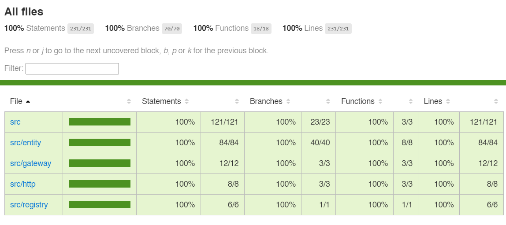

# 2025 - TDD e Clean Architecture no frontend com React 

## Visão geral

1. Crie um frontend para fazer uma criação de contas em 3 etapas.
1. Escolha do tipo de conta: Administrador, Editor ou Operador
1. Dados da conta: Nome, CPF e cargo
1. Dados de acesso: Email, senha e confirmação de senha

## Requisitos

- Exibir mensagem de validação caso algum campo obrigatório não esteja preenchido
- Impedir navegação para o próximo passo se o passo anterior não estiver válido
- Exibir em que passo o usuário está (ex. 1, 2 ou 3) e o percentual de progresso

## Branches de referência

- Branch limpa: https://github.com/douglasjunior/react-tdd-clean-arch/tree/start
- Aplicação crua: https://github.com/douglasjunior/react-tdd-clean-arch/tree/raw
- Isolamento de framework and drivers: https://github.com/douglasjunior/react-tdd-clean-arch/tree/frameworks-and-drivers
- Desacoplamento entre use case e entity: https://github.com/douglasjunior/react-tdd-clean-arch/tree/master

## Cobertura de testes

